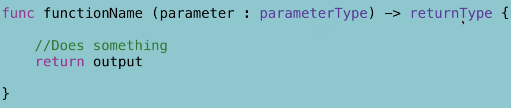
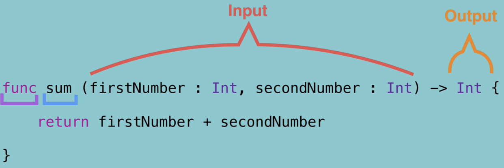
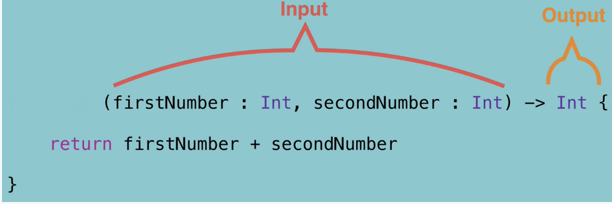
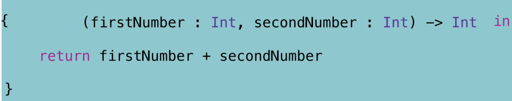
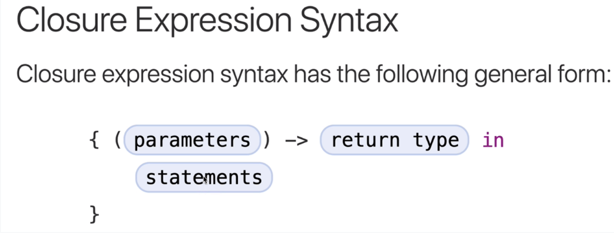

# Closures-Section-13

- closures are anonymous functions, 

- you can actually pass a function as an input to another function
- you can also have a function as the output of another function
- you can consider functions as named closures

Step-1 

Step-2

Closure Scheme

